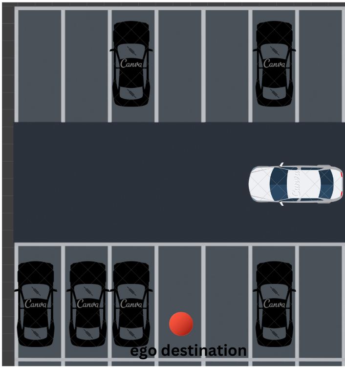
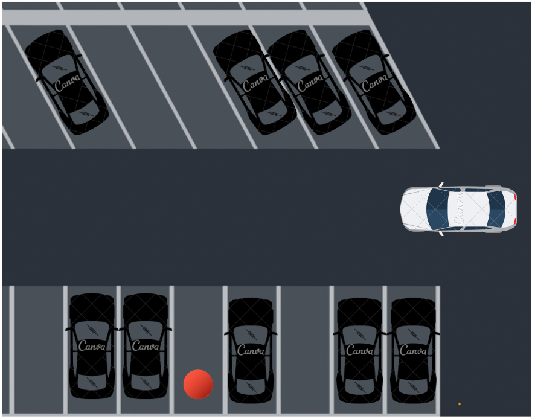
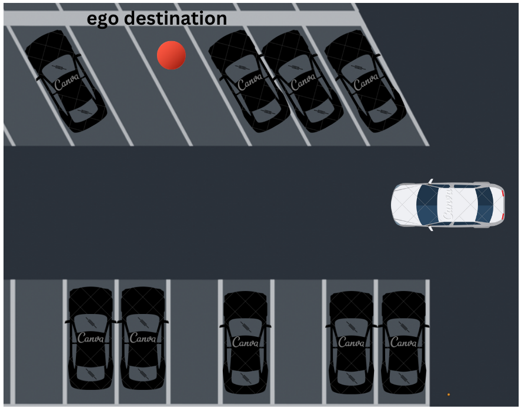
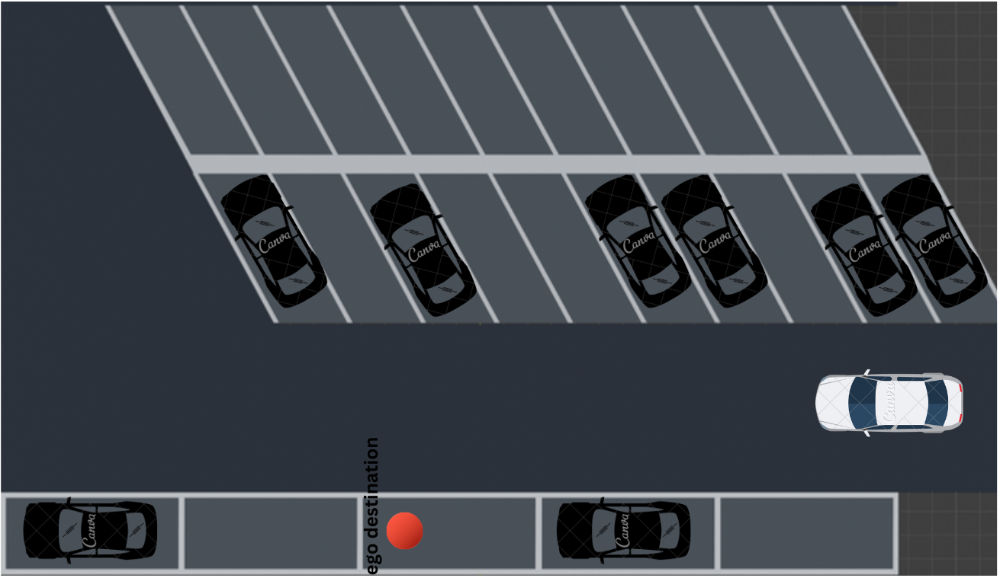
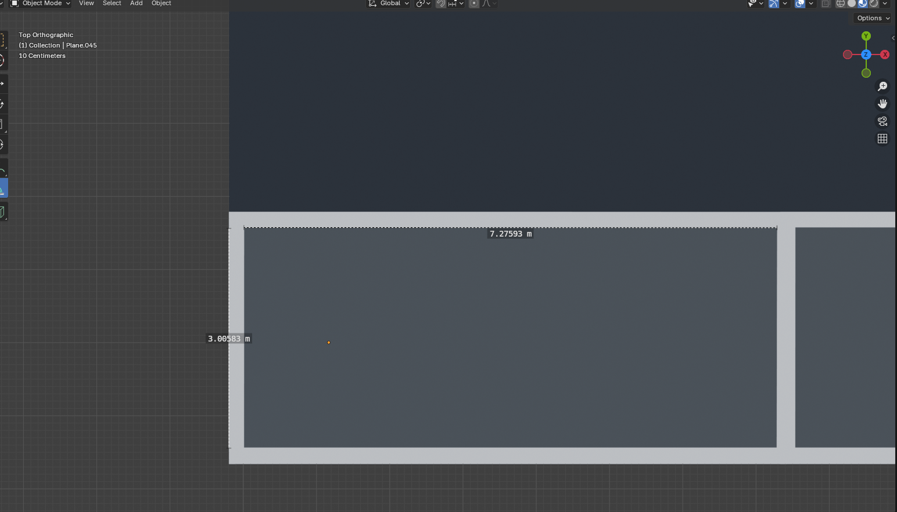
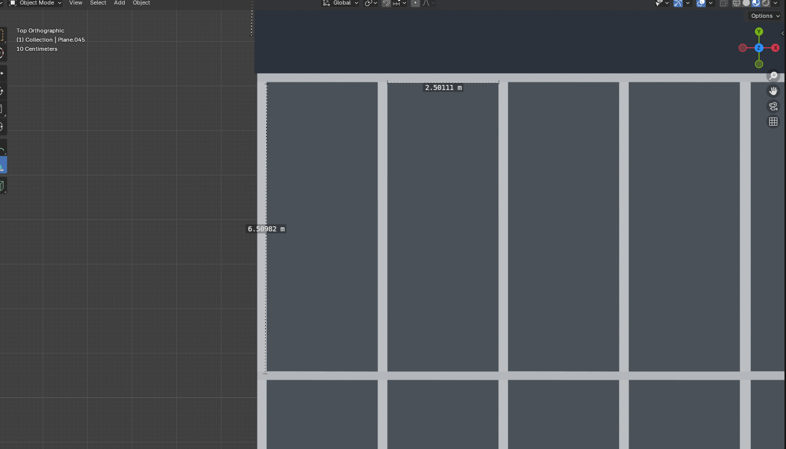
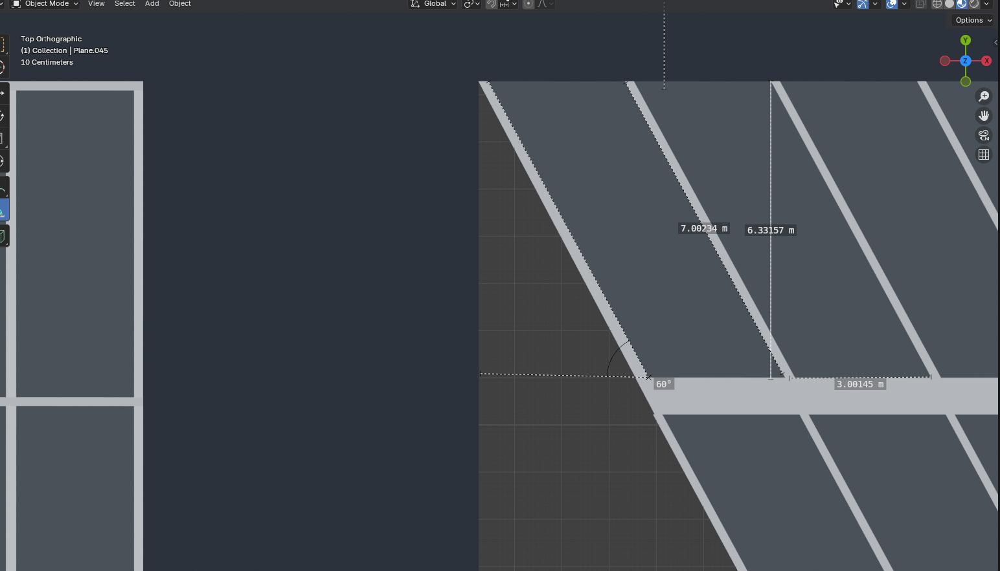

# PARKING AREA DEMO

_After completing the Quick Start demo, you can proceed to this section._

1. Download the lanelet2 and point cloud maps of the parking area.

    [Parking Are Maps](https://autoware-files.s3.us-west-2.amazonaws.com/awsim-labs/parking_area_maps.zip)

2. Download the latest release from:

    [AWSIM Labs GitHub Releases Page](https://github.com/autowarefoundation/AWSIM-Labs/releases){.md-button .md-button--primary}
     and launch `awsim_labs.x86_64`.

3. To use with the scenario simulator, select the **Parking Area ss2** map. For regular use, select the **Parking Area** map.

4. Start the simulation by clicking the **'Load'** button.

5. Now you can use the [e2e_simulator](https://autowarefoundation.github.io/AWSIM-Labs/main/GettingStarted/QuickStartDemo/) or [scenario simulator](https://autowarefoundation.github.io/AWSIM-Labs/main/GettingStarted/UsingOpenSCENARIO/).

# Scenarios:
Four simple scenarios have been created using the [scenario editor](https://github.com/tier4/scenario_simulator_v2) for use in the Parking Area environment. Before the scenarios can be used with the scenario simulator, the tutorial provided [here](https://autowarefoundation.github.io/AWSIM-Labs/main/GettingStarted/UsingOpenSCENARIO/) must be completed.
Below are illustrated explanations of the scenarios.

_The map named 'Parkin_Area_ss2' should be selected from map selection._

!!! Warning

    Sadly, the links to the scenarios are not available at the moment.
    We are working on reuploading them.
    Please check back later.

**Test 1: (L parking next to vehicle)**

**Test 2: (L parking between 2 vehicles)**

**Test 3: (Angled parking next to vehicle)**

**Test 4: (Parallel parking)**

# Dimensions of Parking Areas

The dimensions of the parking spaces were made based on this reference:

   - [https://cdn-wordpress.webspec.cloud/intrans.iastate.edu/uploads/sites/15/2018/12/Chapter_08-2018.pdf](https://cdn-wordpress.webspec.cloud/intrans.iastate.edu/uploads/sites/15/2018/12/Chapter_08-2018.pdf)
   - [https://www.dimensions.com/element/30-degree-parking-spaces-layouts](https://www.dimensions.com/element/30-degree-parking-spaces-layouts)

**Parallel Parking:** 3m x 7.275m   _(The dimensions were set to 1.5 times the size of the Lexus vehicle.)_

**L Parking:** 2.5m x 6m

**Angled parking:** 7m x 3m  &  60-degree

